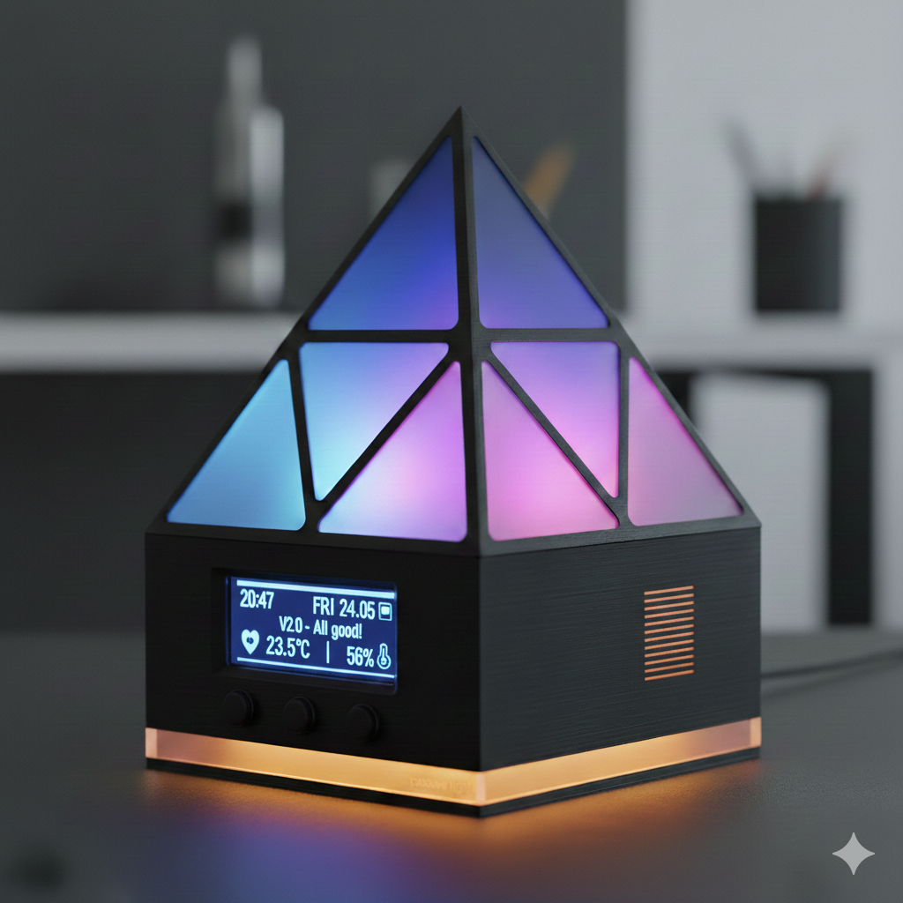

INSANE MOODLIGHT OLED V2.0

Dieses Projekt beschreibt ein fortschrittliches Stimmungslicht auf Basis von ESPHome. Im Fokus stehen Hardware-Stabilität, Signalintegrität und Langlebigkeit der Komponenten.

KONZEPT UND MOTIVATION Das Insane Moodlight V2.0 ist eine dedizierte Hardware-Lösung, die typische Probleme einfacher LED-Projekte adressiert. Dazu gehören eine präzise Spannungsregulierung sowie ein intelligentes Software-Management für das Display und die Energieversorgung.

HARDWARE-SPEZIFIKATIONEN Um einen zuverlässigen Betrieb zu gewährleisten, wurden folgende technische Maßnahmen umgesetzt:

SIGNALQUALITÄT Einsatz eines SN74AHCT125N Levelshifters zur Anhebung der Datenpegel auf 5V, unterstützt durch einen 100nF Keramikkondensator zur Entstörung.

REFLEXIONSSCHUTZ Integration von 62-Ohm-Widerständen in den Datenleitungen zur Vermeidung von Signalfehlern.

SPANNUNGSGLÄTTUNG Umfassende Pufferung durch einen 220uF Elko am ESP8266 und drei 470uF Elkos für die 5V-Schiene zur Vermeidung von LED-Flackern.

SICHERHEIT Absicherung des Systems durch eine Glassicherung und Verwendung eines LiPo-Ladereglers für die 18650er Zelle.

SENSORIK Erfassung von Temperatur und Luftfeuchtigkeit via DHT-Sensor sowie Batterieüberwachung über den Analog-Eingang (A0) mit einem 100k Widerstand.

SOFTWARE-FUNKTIONEN

DISPLAYSCHUTZ UND BETRIEB Ein integrierter Pixel-Shift verschiebt den Bildinhalt alle zwei Minuten, um ein Einbrennen des OLED-Displays dauerhaft zu verhindern. Die Boot-Logik stellt sicher, dass Systemmeldungen die im Flash gespeicherten Nutzer-Nachrichten nicht beeinträchtigen.

LICHTSTEUERUNG UND INTERAKTION Master-Toggle: Speicherung aktueller Farb- und Helligkeitswerte beim Ausschalten, um beim nächsten Start exakt den vorherigen Zustand wiederherzustellen. Gruss-Modus: Auslösen von animierten Symbolen (Herz, Stern, Smiley) und individuellen Textzeilen via Home Assistant oder physischem Taster.

BATTERIEMANAGEMENT Das System verfügt über eine visuelle Warnfunktion bei niedrigem Akkustand: Unter 10 Prozent Kapazität: Rotes Blinken der passiven LEDs im 10-Sekunden-Intervall. Unter 5 Prozent Kapazität: Verkürzung des Warnintervalls auf 5 Sekunden.

INSTALLATION

Erstellung der secrets.yaml mit den individuellen Netzwerkzugangsdaten.

Kompilierung und Upload via ESPHome.

Integration in Home Assistant zur Steuerung der Helligkeit, Farben und Effekte.
