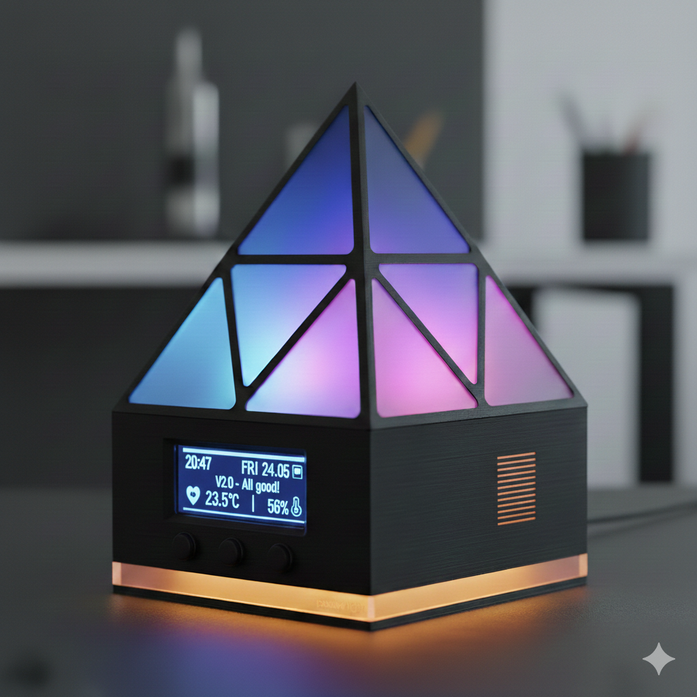

# ✨ Insane Moodlight OLED V2.0
<div align="center">
  
  
  
  
  
</div>
<br>

Willkommen beim **Insane Moodlight OLED V2.0** – Einem fortschrittlichen Stimmungslicht auf Basis von ESPHome. Mit einem klaren Fokus auf Hardware-Stabilität, Signalintegrität und Langlebigkeit entwickelt für die perfekte Atmosphäre in deinem Smart Home.

<div align="center">
  
</div>

---

## 💡 Konzept & Architektur
Das Insane Moodlight V2.0 adressiert typische Probleme von DIY-LED-Projekten durch präzise Spannungsregulierung und intelligentes Software-Management für Display und Energieversorgung.

### 🔥 Hardware-Specs
* **Levelshifter:** SN74AHCT125N für saubere 5V Datensignale.
* **Signalintegrität:** 62-Ohm Datenwiderstände in den Leitungen eliminieren Reflexionen und garantieren ein perfektes Signalbild.
* **Spannungsglättung & Pufferung:** 220uF (ESP) und 3x 470uF (LEDs) kapazitive Pufferung verhindern LED-Flackern bei Lastspitzen.
* **Akku & Energiemanagement:** 18650 Li-Ion Batterie in Kombination mit einem TP4056 Laderegler für den autarken Betrieb. Absicherung durch eine Glassicherung.
* **Sensorik:** Erfassung von Umgebungsdaten via DHT-Sensor.
* **Telemetrie:** Präzise Batterieüberwachung über einen Spannungsteiler am Analog-Eingang A0.

### 🧠 Software-Logik & Features
* **OLED-Schutz (Pixel-Shift):** Ein integrierter Pixel-Shift verschiebt den Bildinhalt alle zwei Minuten, um ein Einbrennen des OLED-Displays dauerhaft zu verhindern. Die Boot-Logik schützt gespeicherte Nutzer-Nachrichten im Flash-Speicher.
* **Interaktion & Speicher:** Der Master-Toggle speichert aktuelle Farb- und Helligkeitswerte beim Ausschalten global. Beim Neustart wird der exakte vorherige Zustand wiederhergestellt.
* **Gruß-Modus:** Ermöglicht animierte Symbole (Herz, Stern, Smiley) und individuelle Texte direkt auf dem Display.
* **Smartes Energiemanagement:** Automatisches Warnsystem bei kritischer Spannung:
  * Unter 10% Kapazität: Rotes Blinken (10s Intervall)
  * Unter 5% Kapazität: Rotes Blinken (5s Intervall)

---

## 📐 Mechanischer Aufbau
<div align="center">
  <b>Gehäuse:</b> 15x15 cm Basis | 5 cm Sockel | 3D-Druck optimiert
</div>
<br>

* **Design:** Die Pyramidenflächen sind für optimale Lichtdiffusion konstruiert. Ein transparenter Streifen am Sockel sorgt für ein dezentes "Passive Light".
* **Bedienung:** Zentrales OLED-Display mit drei darunterliegenden haptischen Mikroschaltern für die direkte Systemsteuerung ganz ohne App-Zwang.

---

## 🛠️ Installation & Smart Home Integration
Jeder kann dieses Projekt nachbauen und in Home Assistant integrieren.

### Schritt-für-Schritt
1. **Hardware Aufbau:** Im Repository befindet sich ein dedizierter Ordner mit den **Gerber-Dateien**. Damit kann die passende Platine direkt bei einem Platinen-Service (z.B. JLCPCB oder PCBWay) bestellt werden. Alternativ kannst du die Sensoren und Komponenten auch per Hand verdrahten.
2. Auf der Platine wurden gezielt Lötpads für die Pins `RST`, `D0` und `RX` herausgeführt. Diese dienen als Schnittstellen für zukünftige Hardware-Erweiterungen.
3. Erstelle eine `secrets.yaml` in deinem ESPHome Ordner und konfiguriere deine Netzwerkdaten:
   ```yaml
   api_encryption_key: "DEIN_API_KEY"
   ota_password: "DEIN_OTA_PASSWORD"
   wifi_ssid: "DEIN_WLAN_NAME"
   wifi_password: "DEIN_WLAN_PASSWORT"
   ap_password: "DEIN_FALLBACK_HOTSPOT_PASSWORT"
   ```
4. Lade den Code via **ESPHome** auf deinen Wemos D1 Mini hoch.
5. **Home Assistant Integration:** Füge das Gerät zu Home Assistant hinzu. Die vollständige Steuerung erfolgt über HA, wo alle Parameter (Display-Helligkeit, individuelle Gruß-Texte, etc.) verwaltet werden.

<br>
<div align="center">
  
  
  
</div>
<br>

---

## ⚖️ Lizenz
Dieses komplette Projekt (Hardware und Software) steht unter der [CC BY-NC-SA 4.0 Lizenz](https://creativecommons.org/licenses/by-nc-sa/4.0/).
Das bedeutet: Nachbauen und Anpassen für private Zwecke ist ausdrücklich erwünscht, jede kommerzielle Nutzung oder der Verkauf sind strikt verboten!

---

## ☕ Support dieses Projekts
Wenn dir das Projekt gefällt und du meine Arbeit unterstützen möchtest, freue ich mich riesig über einen virtuellen Kaffee!

<a href="https://www.paypal.me/babeinlovexd">
  
</a>

Jeder Cent fließt direkt in die Entwicklung neuer Projekte! 🚀
---

## 👨‍💻 Entwickelt von

| [<br><sub>**Christopher**</sub>](https://github.com/babeinlovexd) |
| :---: |

<div align="right">
  <i>Entwickelt für Angelina.</i>
</div>
